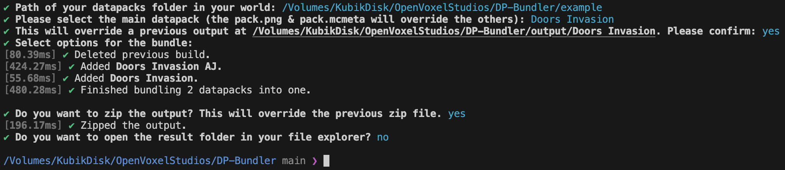
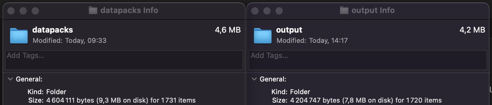

# Datapack Bundler

Bundles multiple datapacks into one! Practical for releasing one datapack based on two or more (if you separate your animated java datapack from your main one, well this is for you).



## Why?

This **reduces the size** of your datapack!

When using on my [Doors Infestation]() project, it reduced by almost 9% (from 4.6MB to 4.2MB)! (with all options enabled)



## Features

-  Bundle datapacks together up to 1.21 (and futher)!
-  Select main datapack for `pack.png` and `pack.mcmeta`
-  Bundle Options:
   - Remove empty lines
   - Remove comments
   - Remove non .json/.mcfunction/.nbt files
- Zip the output datapack

## How to use?

### From release

You have access to compiled versions of this program. Click on the [latest release](https://github.com/OpenVoxelStudios/DP-Bundler/releases/latest) and download the version for your operating system. This has support for Mac (M-Chip and Intel-Chip), Linux and Windows (x64).

1. On Mac and Linux, once downloaded, you have to run `chmod +x filepath` first to make the file executable and then you can either run it from the terminal again or run it from your file explorer.
2. On Windows, you can directly run the .exe from the file explorer by double clicking on it.

### Manually

You need to have [Bun](https://bun.sh) installed.

```bash
# Clone the repository
git clone https://github.com/OpenVoxelStudios/DP-Bundler/
cd ./DP-Bundler
# Install the dependencies
bun install
# Run the code
bun index.ts
```